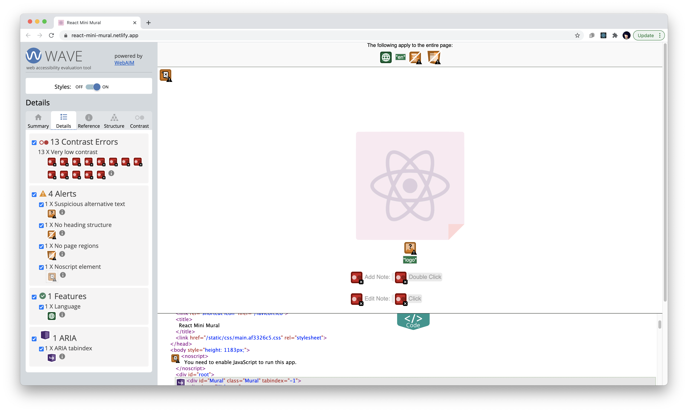

# roadmap for mini-mural a11y

## Initial audit observations

WAVE audit

* Only react logo and how to guide are SR visible
* silly logo alt-text, -> "logo, empty group"
* completely keyboard inaccessible, tabindex="-1"
* Cheating tests:
  * clicking color icon w/ mouse = "newline"
  * double clicking on canvas, aka creating sticky = "selected", and not SR focusable
  * after entering text in a sticky, SR can access it
* I don't quite understand why, but tabindex doesn't necessarily make it visible to SR. e.g. added tabindex 0 to one of the colorBox's, and it's still not SR focusable
  * some things are aria hidden but the elements don't seem to be
* and there's a clipboard manager that's aria-hidden?
* there is a .Mural:focus style that's outline: none...

## Priorities

### Primary

#### Semantics

* Make ColorBox a button
* Add h1 and title
* give things reasonable names

#### Keyboard interactions

* ~~Add "backspace" keypress to delete **OR** make delete icon (FontAwesomeButton) tabbable~~ done
* ~~remove unnecessary tabIndex="-1" from Mural component~~ done
* Add keyboard focus to StickyNote event listener
* add "esc" keypress to textarea when editMode === true to move to selected state

### Secondary

* add keyboard instructions (e.g. Add Note, Edit Note) as a popup menu
* make clipboard manager always on, group w/ above instructions
* add keyboard shortcut to create new note
* make sticky notes a traversable list

## Further considerations

Development was done on a Mac, and I did not test on a PC. Would consider if the chosen keyboard mappings conflict with either Windows or Mac system mappings (e.g. `ctrl` + `v` was chosen to avoid overlapping with `cmd` + `v`, but what about on PC)

### Open Issues

| Priority   | Status        | Component                        | Description                                                                                                                                                                                                                                                                              |
| ---------- | ------------- | -------------------------------- | ---------------------------------------------------------------------------------------------------------------------------------------------------------------------------------------------------------------------------------------------------------------------------------------- |
| ~~P1~~     | `CLOSED`      | ~~General~~                      | ~~Focus is lost upon "button press" of ColorPicker; jumps to next interactive element, which is Add Note button. Same with pressing Delete button~~                                                                                                                                      |
| ~~P2~~     | `CLOSED`      | ~~Color Picker (_Content_)~~     | ~~improve description of color picker descriptions; currently just reads "pink"/etc.~~ Added aria-label to Color Picker group so buttons make sense in context.                                                                                                                          |
| **P0**     | `featRequest` | Sticky Notes                     | Multi-select with keyboard is COMPLETELY NON-EXISTENT                                                                                                                                                                                                                                    |
| **P0**     | `open`        | Sticky Notes / Clipboard Manager | copy/paste is as broken as keyboard select, but works for what is able to be selected.                                                                                                                                                                                                   |
| **P0**     | `open`        | Clipboard Manager                | Add ARIA announcement for copied/paste                                                                                                                                                                                                                                                   |
| ~~**P0**~~ | `closed`      | ~~Sticky Notes~~                 | ~~Inner content is not accessible via screen reader~~ `
` content has been added to Sticky Notes `aria-labelledby`                                                                                                                                                                     |
| ~~P1~~     | `closed`      | ~~Sticky Notes~~                 | ~~Screen reader focus doesn't trigger selected state change~~                                                                                                                                                                                                                            |
| P1         | `open`        | Sticky Notes                     | Custom focus state is not removed when focus moved from first or last Sticky Note to out of Mural                                                                                                                                                                                        |
| P1         | `open`        | ColorPicker                      | (`VO`, Safari) When entering Toolbar for first time, focus is set to first element ("pink, button"), but the Color Picker group isn't accessible or being read. Only after navigating out of color picker and then back do you hear "color picker, group"                                |
| P1         | `open`        | Welcome / Help button            | Modal not complete; focus isn't trapped within modal, so if Welcome is opened or left open while notes are present, it will push them down the page.                                                                                                                                     |
| P1         | `open`        | Add Note Button / ariaAnnounce   | remaining on the same button and triggering multiple keypresses fails to update aria-live region (e.g. when adding multiple notes in succession)                                                                                                                                         |
| P2         | `open`        | Mural / ColorBox                 | On page load/refresh, focus is set to the Pink (first) color box button by default, not sure why. It should be focusing on the first thing in the DOM, which is the Welcome component.                                                                                                   |
| P2         | `open`        | Sticky Notes (_Content_)         | delete button doesn't indicate which note it is associated with                                                                                                                                                                                                                          |
| P2         | `open`        | Sticky Note                      | Broken styling logic; single mouse click triggers "editing" styling                                                                                                                                                                                                                      |
| P2         | `featRequest` | General                          | After creating a new note, set focus to it                                                                                                                                                                                                                                               |
| P2         | `open`        | Sticky Notes:Delete              | Since the Delete icon is only surfaced via note selection, but is injected into DOM Order after the note, it is "skipped" when tabbing backwards                                                                                                                                         |
| P3         | `open`        | Mural.jsx (line 52)              | Since stickies are positioned according to top left corner coordinates, a note could be placed where the corner is within the 100vh/vw window but the body of the sticky note extends the window size, which then extends the max coordinate that can be used for placement, and repeat. |
| P3         | `featRequest` | Color Picker                     | Make this an input type="radio", or at least an ARIA role="radiogroup" as in this [W3C toolbar example](https://www.w3.org/TR/wai-aria-practices/examples/toolbar/toolbar.html).                                                                                                         |
| P4         | `confused`    | Mural                            | When the announcement `` was the first item in DOM, Safari had a weird bug where the Mural canvas would appear "selected" after any action was made. Moving the span to the bottom of the DOM fixed it.                                                                            |

## Other notes

DO NOT use `role="application"`, as this disables native keyboard behaviors and controls (e.g. `cmd` + `c`)

`aria-pressed` syntax confers a checkbox-style toggle property to buttons. Possible use in sticky note multiselect.

## Resources

* W3C [fake button implementation](https://www.w3.org/TR/wai-aria-practices-1.1/examples/button/button.html) resources
* Inclusive Components' [Toggletip tutorial](https://inclusive-components.design/tooltips-toggletips/) and rationale
* Inclusive Components' [Menu Buttons](https://inclusive-components.design/menus-menu-buttons/) discussion;
* Re-reading [React refs documentation](https://reactjs.org/docs/refs-and-the-dom.html) -> realization of how to code Sticky Notes
* I'm too tired to understand react lifecycles to implement, but pretty sure this will be useful later: https://medium.com/swlh/improve-accessibility-in-your-react-app-by-managing-focus-in-mutable-content-4ddf4ed92186
