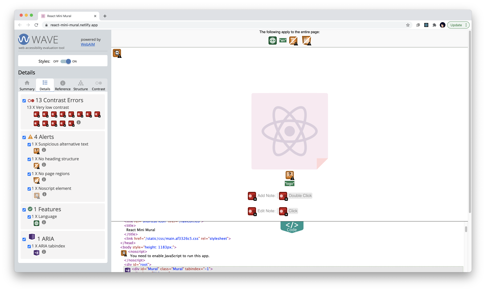

# roadmap for mini-mural a11y

## Initial audit observations

WAVE audit

* Only react logo and how to guide are SR visible
* silly logo alt-text, -> "logo, empty group"
* completely keyboard inaccessible, tabindex="-1"
* Cheating tests:
  * clicking color icon w/ mouse = "newline"
  * double clicking on canvas, aka creating sticky = "selected", and not SR focusable
  * after entering text in a sticky, SR can access it
* I don't quite understand why, but tabindex doesn't necessarily make it visible to SR. e.g. added tabindex 0 to one of the colorBox's, and it's still not SR focusable
  * some things are aria hidden but the elements don't seem to be
* and there's a clipboard manager that's aria-hidden?
* there is a .Mural:focus style that's outline: none...

## Priorities

### Primary

#### Semantics

* Make ColorBox a button
* Add h1 and title
* give things reasonable names

#### Keyboard interactions

* ~~Add "backspace" keypress to delete **OR** make delete icon (FontAwesomeButton) tabbable~~ done
* ~~remove unnecessary tabIndex="-1" from Mural component~~ done
* Add keyboard focus to StickyNote event listener
* add "esc" keypress to textarea when editMode === true to move to selected state

### Secondary

* add keyboard instructions (e.g. Add Note, Edit Note) as a popup menu
* make clipboard manager always on, group w/ above instructions
* add keyboard shortcut to create new note
* make sticky notes a traversable list

## Further considerations

Development was done on a Mac, and I did not test on a PC. Would consider if the chosen keyboard mappings conflict with either Windows or Mac system mappings (e.g. `ctrl` + `v` was chosen to avoid overlapping with `cmd` + `v`, but what about on PC)

### Open Issues

| Status | Component           | Description                                                                                                                                                                      |
| ------ | ------------------- | -------------------------------------------------------------------------------------------------------------------------------------------------------------------------------- |
| `open` | Mural.jsx (line 52) | KNOWN BUG: due to top left corner placement, a note could be placed somewhere that extends the window size, which then extends the max coordinate that can be used for placement |
| `open` | Sticky Notes        | Since the Delete icon is only surfaced via note selection, but is injected into DOM Order after the note, it is "skipped" when tabbing backwards                                 |
| `open` | Color Picker        | Focus is lost upon "button press"                                                                                                                                                |

## Other notes

DO NOT use `role="application"`, as this disables native keyboard behaviors and controls (e.g. `cmd` + `c`)

`aria-pressed` syntax confers a checkbox-style toggle property to buttons.

## Resources

* W3C [fake button implementation](https://www.w3.org/TR/wai-aria-practices-1.1/examples/button/button.html) resources
